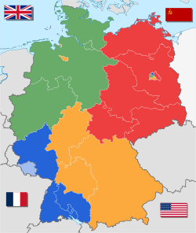
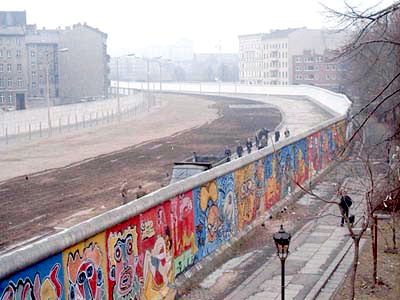
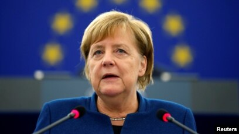

## **Post World War II**

After defeat in World War II, the state of Germany as it had previously existed was no more. Sovereign authority over Germany passed to the Allied powers, who chose to divide it into four occupied territories. 

The four occupying powers- the United States, the USSR, Great Britain, and France- each took a portion of German land. The US, Great Britain, and France consolidated their area into one territory, which became the Federal Republic of Germany, also known as West Germany. The Soviet Union's portion of Germany became the German Democratic Republic, or East Germany. The capital city of Berlin, located in the middle of East Germany, was also divided between the four Allied powers. 

## **The Cold War** 

In the following years, the divided Germany became a center for tension between the Soviet Union and the United States. 

West Germany, gained back autonomy from the US, France, and Great Britain in 1955 and allied itself closely with the West. West Germany was an early member of the North Atlantic Treaty Organization, joining in 1955, and embracing a multinational security strategy. Additionally, West Germany was a member of the European Coal and Steel Community, which was the predecessor to the European Union. 

East Germany, on the other hand, became part of the eastern bloc and entered the Warsaw Pact in 1955. The East German government was controlled by the communist party and sought a close relationship with the USSR, who declared East Germany an independent state in 1954. 

Relations between East and West Germany were strained from the beginning, reflecting the growing dissonance between the West and the Soviet Union. In 1952, borders between East and West Germany were closed by the East Germany government. Initially Berlin enjoyed free movement between the eastern and western halves, but Berlin too was sealed with the construction of the Berlin Wall in 1961. 

Additionally, West Germany refused to recognize the existence of East Germany and refused to maintain relations with any countries that recognized East Germany (outside of the Soviet Union). This strategy was abandoned in 1970 and relations were normalized between the two Germanys. 

## **Reunification to Present**

For the second half of the 20th century, German foreign relations was as much about policy with other nations as with itself. But on October 3, 1990, The German Democratic Republic was absorbed into the Federal Republic of Germany, and Germany was whole again. 

Following reunification, Germany dove headfirst into the multilateral foreign policy strategy, helping to establish the European Union in 1991. Germany's commitment to liberal international institutions is clear as they continue to be a leader within the EU and NATO. 

Germany grew to be a leader in maintaining the security and stability of Europe through its vigorous support of international institutions. It had a hand in the creation of the European Union and the eurozone. Germany continues to pursue global strategies to foreign relations issues today. Military operations were mostly kept within the realm of domestic security, though Germany's industrial sector developed to be able to make a wide range of weapons and technology for land, sea, and air military operations. Due to the manufacturing capabilities, Germany is one of the world's leading arms exporters. 

Post-reunification Germany has been called a "reluctant hegemon" by some, as they have become a foreign policy leader in Europe though are cautious due to their history of militarism. Time will tell if Germany becomes more assertive in the international system in the future.

