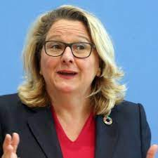

Foreign policy is created at the federal level in Germany. The Bundestag and the Federal Cabinet, under the authority of the Chancellor work to legislate and implement foreign policy. Though all cabinet agencies and most legislative committees deal with foreign policy to some degree, the primary agencies are the Ministry of Defense, the Federal Foreign Office, and the Ministry of Economic Cooperation and Development. Given that the Chancellor directly recommends cabinet ministers for appointment by the president, foreign policy conforms with the Chancellor's policy goals. 

### **Economic Foreign Policy**

The Ministry for Economic Cooperation and Development coordinated economic policy between Germany and nations that receive aid loans. The MECD also works closely with the Federal Foreign Office and international ogranizations on development policy. 

### **Diplomatic Administration**

The Federal Foreign Office is the cabinet ministry charged with maintaining Germany's missions abroad. This includes diplomatic relations with other nations on an individual level or at the inter- and supranational organizational level. 

### **Military Defense**

The Ministry of Defense manages the The Federal Armed Forces of Germany (Bundeswher) during peacetime. In times of conflict and war, the direct management authority transfers to the Chancellor. 

The Bundeswher is under the control of the Bundestag (parliament), and was created to be a citizens defense force, with officers trained with the role of the military in a democracy kept in mind. Over time, the role of the Bundeswher has shifted from border security to involvement in disputes abroad. This shift has resulted in a massive re-ogranization of the armed forces in order to reduce spending and more align with current foreign policy interests. Additionally, Germany is a contributing member of EuroCorps. 

As of 2021, there are approximately 184,000 active duty personnel. In 2020, Germany announced a plan to increase the size of the military, aiming for a total of 200,000 troops by 2025. 

